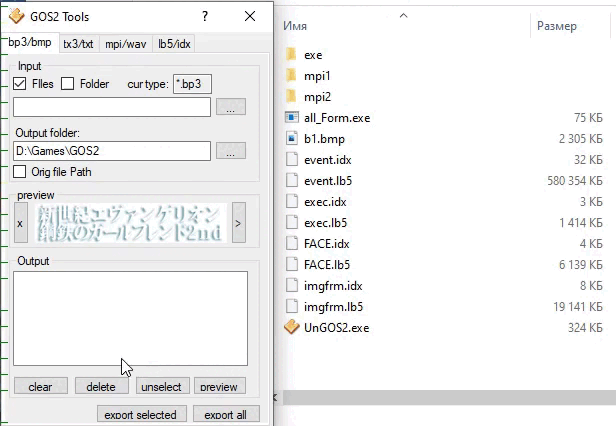

# **Tools for games Evangelion "Girlfriend of Steel 2" **
#### also a plugin for Noesis. allows you to open *.bp3 and also export any image to .bp3 [GitHub Pages](https://github.com/Durik256/Noesis-Plugins/blob/master/tex_bp3.py) 
#### all_Form.exe: 

> drop your file on *.exe or with cmd: 

- BMPtoBP3.exe yourfile.bmp  //convert [BMP] >> [BP3] 
- BP3toBMP.exe yourfile.bp3  //convert [BP3] >> [BMP] 
- LB5_IDX_UNPK.exe yourfile.idx/.lb5  //unpack [LB5] 
- pack_FILEStoLB5_IDX.exe yourfile0.* yourfile1.* ...  //pack files to [LB5]/[IDX] 
- MPI_WAV.exe yourfile.mpi  //convert [MPI] >> [WAV] 
- MPI_WAV.exe yourfile.wav  //convert [WAV] >> [MPI] 
- TX3andTXT.exe yourfile.tx3  //convert [TX3] >> [TXT] 
- TX3andTXT.exe yourfile.txt  //convert [TXT] >> [TX3] 

#### scene viewer.exe: 
just a test. I won’t do it further because there are problems with transparent in windows form 

